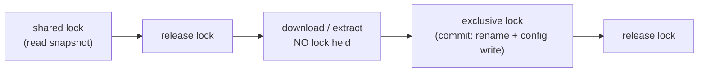
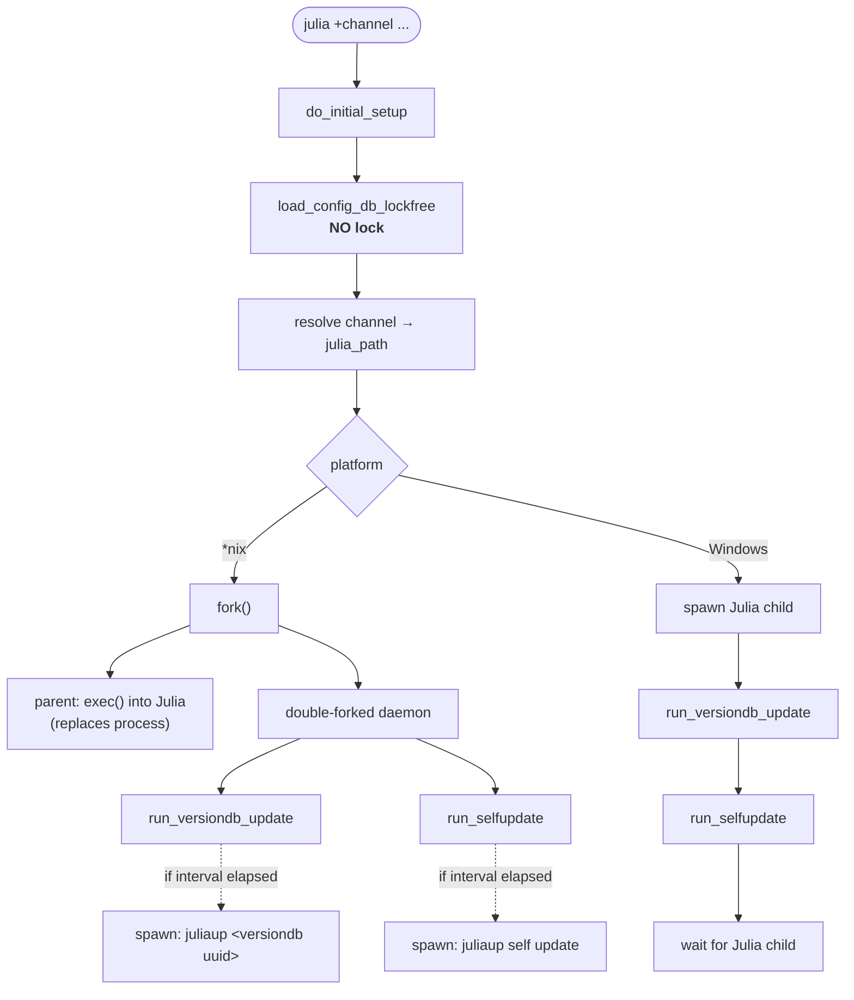
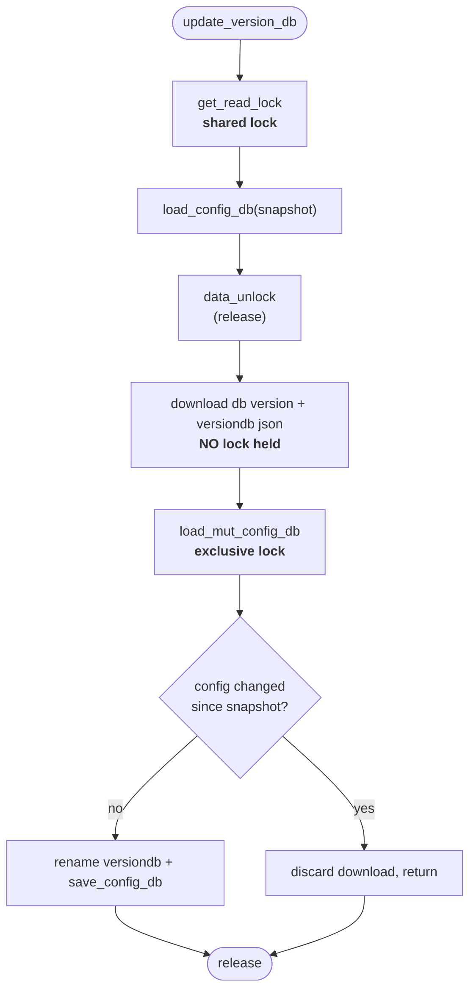
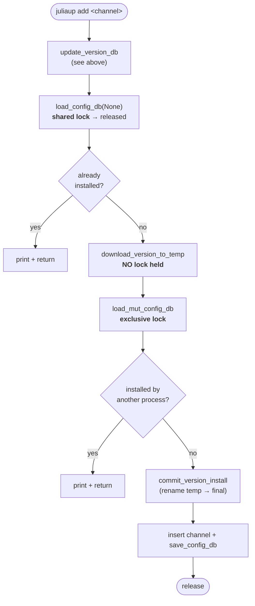
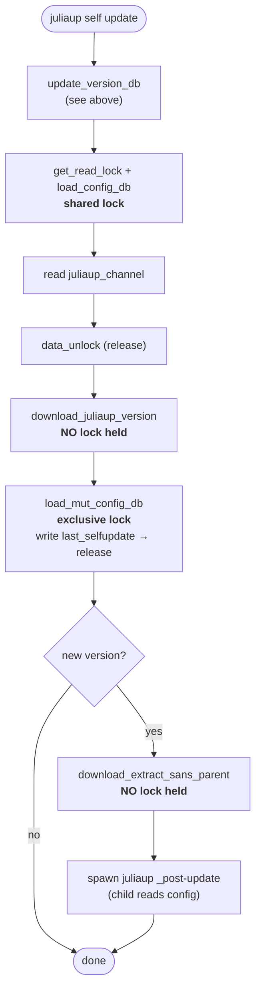
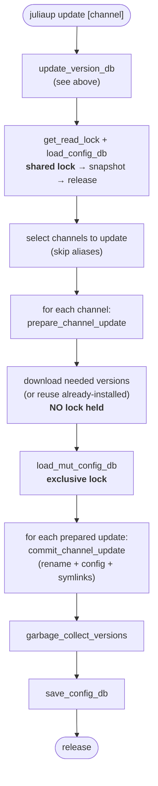
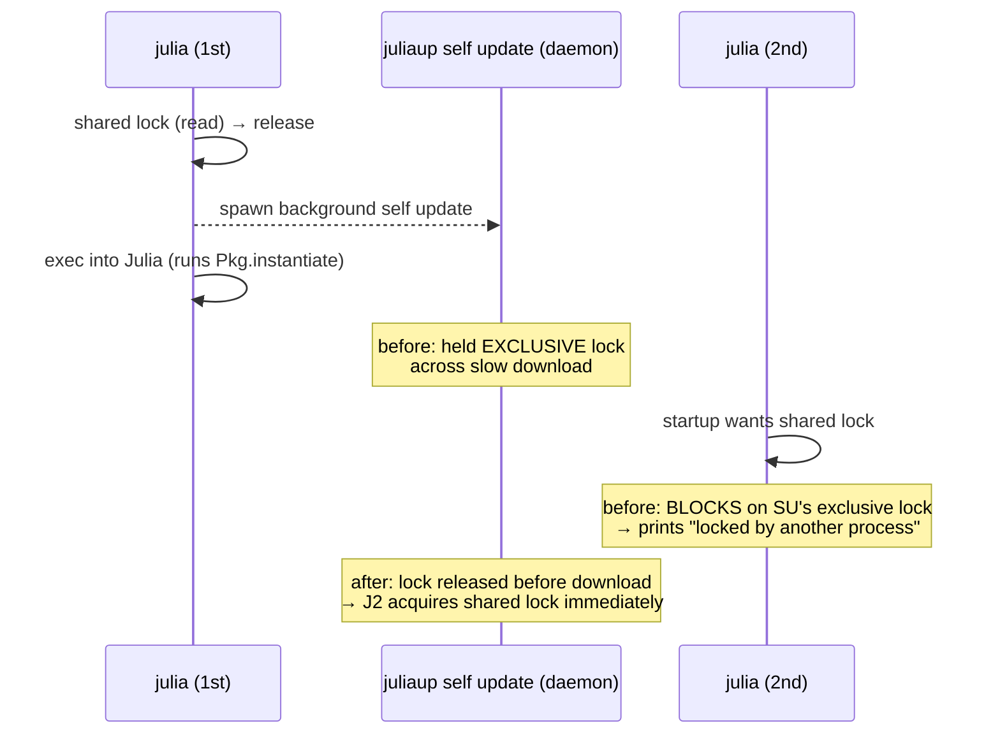

# Configuration locking & update flows

This document describes how juliaup serializes access to its configuration
(`juliaup.json`) and where the configuration lock is held during the various
launcher and update code paths. It exists primarily to make the locking
behaviour auditable, since holding the lock across network operations has
historically caused spurious "configuration is locked by another process"
stalls (see [#1524](https://github.com/JuliaLang/juliaup/issues/1524)).

## The lock

All access to the configuration is serialized through a single lock file
(`paths.lockfile`) using advisory file locks (`cluFlock`). There are two lock
modes:

| Mode | Acquired by | Blocks |
| --- | --- | --- |
| **Shared** (read) | `get_read_lock` / `load_config_db(paths, None)` | only an exclusive holder |
| **Exclusive** (write) | `load_mut_config_db` | any other shared or exclusive holder |
| **None** (lock-free read) | `load_config_db_lockfree` | nothing — never blocks, never blocked |

Many readers can hold the shared lock simultaneously. A single writer holding
the exclusive lock blocks everyone, including readers. The user-visible message

> Juliaup configuration is locked by another process, waiting for it to unlock.

is printed whenever a process cannot acquire the lock it wants within a short
grace period (1 second) and falls back to a blocking wait. The acquisition is
retried (polling) during the grace period, so the message is suppressed for the
common case where another process holds the lock for only a few milliseconds
(e.g. while committing a config change). Both `get_read_lock` and
`load_mut_config_db` route through `lock_with_delayed_message` to get this
behaviour.

### Design rules

> **All writes to `juliaup.json` must replace the file atomically.**

Every writer goes through a temp-file-in-same-directory + rename
(`save_config_db`, and `create_initial_config_file` for the very first
config). This invariant is load-bearing: it is what makes the lock-free read
path (`load_config_db_lockfree`, used by `julialauncher`) safe — a reader
always observes either the old or the new file in full, never a torn write.
Never write to `juliaup.json` in place.

> **Never hold the exclusive lock across a network operation.**

Downloads can be slow or hang. A writer that holds the exclusive lock across a
download blocks every concurrent `juliaup` invocation (each of which needs at
least a shared lock at startup) for the entire duration of the download. The commands below follow a common pattern to honour this rule:

The download phase produces files in a temporary directory; the commit phase
re-checks the configuration (optimistic concurrency) and atomically renames the
result into place while holding the exclusive lock only briefly.

## `julialauncher` (the `julia` shim)

Every `julia` invocation runs the launcher, which reads the configuration and
then spawns a background worker that may trigger `juliaup self update` and the
version-db update. On *nix the worker is a double-forked daemon; on Windows it
runs inline before waiting on the Julia child.

Key points:

- The launcher reads the configuration **without taking the lock at all**
  (`load_config_db_lockfree`), so launching Julia can never block on the
  configuration lock — not even during a slow `remove`/`gc` that holds the
  exclusive lock while deleting an installation. This is safe because all
  config writes are atomic file replacements (see design rules above). The
  only launcher paths that touch the lock are cold and interactive: first-run
  setup and the auto-install prompt, both of which spawn `juliaup`.
- `run_versiondb_update` and `run_selfupdate` do **not** run the work inline;
  they merely *spawn* `juliaup` subprocesses (subject to their configured
  intervals). Those subprocesses do the locking described below.
- Because the background self-update runs detached, a slow download there must
  not hold the exclusive lock — otherwise a *later, unrelated* `julia`
  invocation would stall on the shared lock at startup. This is exactly the
  scenario reported in #1524.

## `update_version_db`

Run by `juliaup` directly and as the first step of `add`, `update`, and
`self update`. It reads a config snapshot, releases the lock, downloads the
version database, then re-acquires the exclusive lock to commit — with an
optimistic check that aborts if the config changed underneath it.

## `juliaup add`

Splits installation into `download_version_to_temp` (lock-free) and
`commit_version_install` (exclusive lock). The shared-lock pre-check avoids a
redundant download when the channel is already installed.

For nightly/PR channels (`add_non_db`), `install_non_db_version` →
`install_from_url` downloads into a temp dir and atomically renames into place
with **no lock held**; the exclusive lock is taken afterwards only to write the
config entry.

## `juliaup self update`

Reads the configured juliaup channel under a shared lock, releases it, performs
all network work (version check + binary download/extract) lock-free, and
re-acquires the exclusive lock only to record the self-update timestamp.

The post-update hook runs in a child process that needs to read the config, so
the exclusive lock must not be held when it is spawned — which is naturally the
case here because the lock is released right after the timestamp write.

## `juliaup update`

Two-phase like the others, but fans out over multiple channels: phase 1 takes a
single config snapshot under a shared lock and downloads everything needed
lock-free; phase 2 takes the exclusive lock once and commits all prepared
updates together.

`commit_channel_update` re-checks that each channel still exists before applying
its update, so a channel removed concurrently is skipped rather than causing an
error. System-channel updates whose target version is already installed skip the
download entirely.

## The #1524 scenario

Sequence that produced the spurious stall, and why it no longer does:

Before the fix, `self update` (and `add` / `update`) held the exclusive lock
across their downloads. A second `julia` started while a background self-update
was downloading would block at startup on its shared-lock acquisition. After the
fix, every command releases the lock before downloading, so the only contention
left is the millisecond-scale commit phase.
